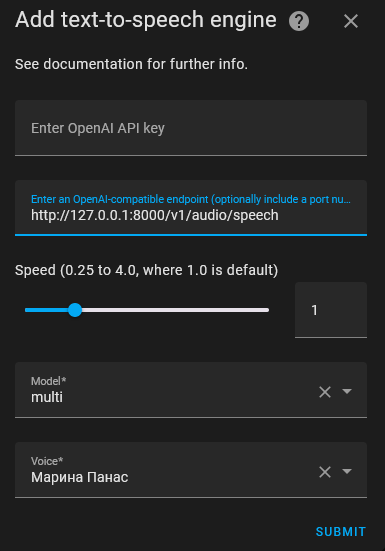

[](https://stand-with-ukraine.pp.ua)
[](https://stand-with-ukraine.pp.ua)
[](https://stand-with-ukraine.pp.ua)
[](https://stand-with-ukraine.pp.ua)

Repository: [ALERTua/styletts2-ukrainian-openai-tts-api](https://github.com/ALERTua/styletts2-ukrainian-openai-tts-api)

GitHub Docker Registry: https://github.com/ALERTua/styletts2-ukrainian-openai-tts-api/pkgs/container/styletts2-ukrainian-openai-tts-api

Docker Hub: https://hub.docker.com/r/alertua/styletts2-ukrainian-openai-tts-api


## Description

Provides OpenAI TTS API endpoints for the [patriotyk/styletts2-ukrainian](https://huggingface.co/spaces/patriotyk/styletts2-ukrainian) Gradio app, based on the Docker image [ALERTua/patriotyk_styletts2_ukrainian_docker](https://github.com/ALERTua/patriotyk_styletts2_ukrainian_docker)

I didn't mean to make this as a full-fledged product. It's just a quick and dirty solution to get the model working with Home Assistant until a better option arrives.
By better option I mean a model of at least the same quality but in Piper-compatible format for easy Home Assistant usage.


### Docker-compose Environment Variables

- `AUTO_USE_VERBALIZER`: automatically use the verbalizer (convert numbers to words) (default: 1)
- `GRADIO_URL`: URL of the Gradio Web UI (default: http://gradio:7860)
- `UVICORN_PORT`: port for the OpenAI TTS API (default: 8000)
- `UVICORN_HOST`: listen interface for the OpenAI TTS API (default: 0.0.0.0)
- `GRADIO_PORT`: port for Gradio Web UI (default: 7860)
- `GRADIO_SERVER_NAME`: listen interface for the Gradio App (default: 0.0.0.0)
- `CACHE_PATH`: cache directory (default: .)


### Deployment

The best way is to use the [docker-compose.yml](/docker-compose.yml)
You can also deploy the Gradio App the way you like and just point this application to it using the `GRADIO_URL` environment variable.


### Resources usage
- tag `latest` uses ~91 MiB of RAM


### Things to do that depend on the author's code

- [ ] A separate endpoint that lists all voices


## TODO

- [ ] a separate verbalization endpoint


### Usage in Home Assistant

- Add https://github.com/sfortis/openai_tts integration to your Home Assistant instance.
- Provide it with the url to the container port.
- You can leave the API key empty, as the endpoint does not check for it.
- Use one of these models: multi, single
- Use one of the voices available: https://huggingface.co/spaces/patriotyk/styletts2-ukrainian/tree/main/voices (filename without .pt). E.g. `Марина Панас`
- If a stress is wrong use ``` ` ``` symbol before a syllable to stress it, e.g. ```русн`я```.
- The model handles short messages poorly so at least end each syntax with a dot.



```yaml
action: tts.speak
data:
  media_player_entity_id: media_player.office_speaker
  message: тестове повідомлення 123.
  cache: false
target:
  entity_id: tts.styletts2
```

### Endpoints

#### Synthesize Speech

**Endpoint:** `POST /v1/audio/speech`

This endpoint synthesizes speech from the given text using the specified voice and parameters.

**Example Request:**

```bash
#!/bin/bash
curl -X POST "http://127.0.0.1:8000/v1/audio/speech" \
-H "accept: audio/wav" \
-H "Content-Type: application/json" \
-d '{
  "input": "Русн+я вже майже вся подохла. Залишилося ще трохи почекати, і перемога буде за нами.",
  "voice": "Марина Панас",
  "speed": 1.0,
  "verbalize": 1
}'
```
```powershell
# powershell
$headers = @{
    "Content-Type" = "application/json"
}

Invoke-RestMethod -Uri 'http://127.0.0.1:8000/v1/audio/speech' `
    -Method POST `
    -Headers $headers `
    -Body '{
        "input": "Зустр`іч признач`ена на 15:30 12.05.2025 у конференц-зал`і №3."
    }' `
    -OutFile 'output.mp3'

explorer.exe output.mp3
```

#### Request Body Parameters

- **model** (string): model name: multi or single
- **input** (string): The text to generate audio for.
- **voice** (string): The voice to use for synthesis.
- **speed** (float): The speed of the speech. Default is `1.0`.
- ~~**response_format** (string): The format of the audio output. Supported formats are `wav` and `mp3`. Default is `wav`.~~
- ~~**sample_rate** (int): The sample rate of the audio. Default is `24000`.~~


### Caveats

- If the verbalizer is off, the model does not handle numbers(!) so make sure to replace them with words.
```python
# pip install num2words

cases = [
    "nominative",
    "genitive",
    "dative",
    "accusative",
    "instrumental",
    "locative"
]

a = num2words(42, lang='uk', to='ordinal') # сорок другий
c = num2words(42, lang='uk', to='cardinal', gender='feminine', case="genitive")  # сорока двох
d = num2words(1442, lang='uk', to='year')  # одна тисяча чотириста сорок два
e = num2words(1444.10, lang='uk', to='currency', currency='USD', cents=False, separator='', adjective=True)  # одна тисяча чотириста сорок чотири долари 10 центів
```
- The verbalization is tricky and may not work as expected. For example:
`це тестове повідомлення номер 2012, яке було видане в 1954 році`
will be verbalized as
`це тестове повідомлення номер дві тисячі дванадцятого року, яке було видане в тисяча дев'ятсот п'ятдесят четвертому році`


Я готовий розширити це readme будь-якою корисною інформацією, лише [скажіть](https://github.com/ALERTua/styletts2-ukrainian-openai-tts-api/discussions/new/choose), чого вам не вистачає.
